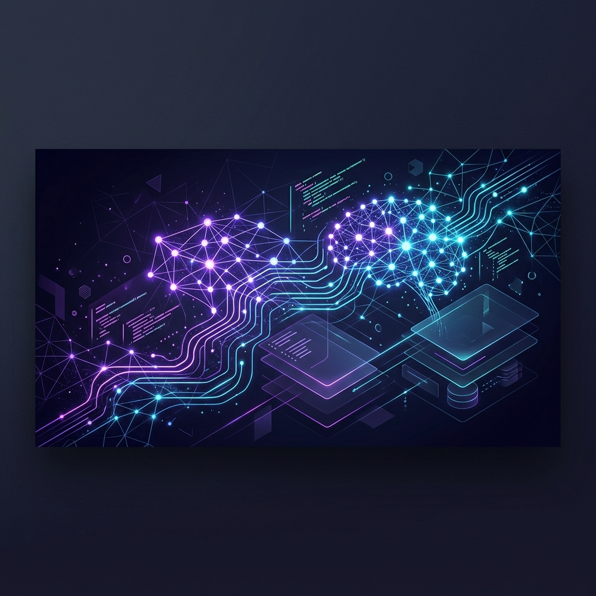

# Miral Parmar | Full-Stack Web Developer, AI Developer & SEO Specialist

  

  
  
  

<h2 align="center">
  
</h2>

---

### 🚀 About Me

I am a results-driven **Full-Stack Web Developer**, **AI Developer**, and **SEO Specialist** focused on crafting high-performance, intelligent, and scalable web solutions. By combining modern front-end frameworks with robust back-end APIs and state-of-the-art AI systems, I build seamless digital experiences that are search engine optimized from the ground up.

- 🔭 **Expertise**: MERN Stack, Next.js, FastAPI, and Chrome Extension development.
- 🧠 **AI Integration**: Injecting intelligence into web architectures using Python, machine learning workflows, and real-time backend integrations.
- 📈 **SEO First**: Architecting semantic HTML structures, structured schema, and blazing-fast site performance to drive organic growth.
- ⚡ **Productivity**: Building custom Chrome Extensions to streamline complex browser workflows.

---

### 💻 Core Focus & What I Build

Here is a breakdown of the key architectures and projects I design and deploy:

*   **Real-Time & Enterprise Web Apps**
    Creating highly responsive SPA and SSR platforms using the **MERN Stack** (MongoDB, Express, React, Node.js) and **Next.js**. Engineered for rapid page speeds, core web vitals compliance, and dynamic user interfaces.
*   **AI-Powered Solutions & Backends**
    Developing high-throughput microservices using **FastAPI** and Python, integrating natural language processing, vector databases, and automated agentic flows to solve complex workflow challenges.
*   **Organic Search & Tech SEO Engines**
    Implementing full-funnel technical SEO, metadata frameworks, programmatic SEO pipelines, and performance audits to ensure applications rank on page one of search engines.
*   **Custom Browser & Chrome Extensions**
    Designing lightweight, secure, and user-centric Chrome Extensions that interact natively with web interfaces to automate manual tasks and integrate APIs.

---

### 🛠️ Tech Stack & Tooling

| Category | Technologies & Badges |
| :--- | :--- |
| **Languages** |      |
| **Frontend Frameworks** |     |
| **Backend & APIs** |     |
| **Databases** |    |
| **SEO & Extensions** |    |
| **Tools & Workflows** |     |

---

### 📈 GitHub Metrics

Here is a live look at my coding activity and repository statistics.

  <table border="0">
    <tr>
      <td align="center" width="50%">
        
      </td>
      <td align="center" width="50%">
        
      </td>
    </tr>
    <tr>
      <td align="center" colspan="2">
        
      </td>
    </tr>
  </table>

---

### 🤝 Let's Connect & Collaborate

I'm always open to talking about potential projects, contract opportunities, AI integration consulting, or technical SEO audits.

- 🌐 **Portfolio & Blog**: [miral-parmar.github.io](https://miral-parmar.github.io)
- 💼 **LinkedIn**: [Connect with me on LinkedIn](https://www.linkedin.com/in/miral-parmar)
- 🐦 **Twitter / X**: [@miral_parmar](https://x.com/miral_parmar)
- 📧 **Direct Email**: [miralparmar.work@gmail.com](mailto:miralparmar.work@gmail.com)

  <a href="#miral-parmar-full-stack-web-developer-ai-developer--seo-specialist">Back to Top ⚡</a>

